<<<<<<< HEAD
# InteligenterAufgabenplanner
=======
# Intelligenter Aufgabenplaner

Dieses Projekt ist ein "Intelligenter Aufgabenplaner", der natürliche Spracheingabe ("Prompting") nutzt, um Aufgaben automatisch mit Metadaten (Datum, Priorität, Kategorie) zu versehen. Es demonstriert eine moderne Web-Architektur mit einem starken Fokus auf **Sicherheit und Datenintegrität** (Encryption at Rest, Rate Limiting, CSP).

## 🏗 Architektur

Das System basiert auf einer klassischen Client-Server-Architektur, erweitert um KI-Komponenten und einen gehärteten Security-Layer.

```mermaid
graph TD
    User["Benutzer (Browser)"] <-->|HTTP / REST| Client["Frontend (React.js)"]
    
    subgraph "Backend Server (FastAPI)"
        Client <-->|API Requests| API[API Router]
        API --> Middleware["Security Middleware (CSP, CORS)"]
        API --> RateLimiter["Rate Limiter (SlowAPI)"]
        API --> Logic["Business Logic & Input Sanitization"]
        Logic <--> Auth["Auth Service (JWT)"]
        Logic <--> Encryption["Encryption Service (Fernet)"]
    end
    
    Encryption <-->|"Verschlüsselte Daten"| DB[("SQLite Datenbank")]
    Logic <-->|"Natural Language Processing"| LLM["LLM Service (OpenAI / LM Studio)"]
```



## ✨ Features

*   **Natural Language Entry:** "Erstelle ein Meeting morgen um 10 Uhr Rot" -> Erstellt Aufgabe am (Datum+1) um 10:00 mit Farbe Rot.
*   **Sicherheits-Architektur:**
    *   **Encryption at Rest:** Sensible Aufgabendaten liegen AES-256 verschlüsselt in der Datenbank.
    *   **Rate Limiting:** Schutz vor Brute-Force (Login: 10 Versuche/Min).
    *   **XSS Protection:** Input Sanitization mittels `bleach` und Content-Security-Policy (CSP).
    *   **Secure Headers:** CSP, X-Content-Type-Options, X-Frame-Options.
*   **Technologie:**
    *   Backend: Python 3.11, FastAPI, SQLAlchemy, Pydantic.
    *   Frontend: React 18, Node.js.

## 🚀 Installation & Setup

Voraussetzungen:
*   Python 3.11+
*   Node.js & npm

### 1. Repository klonen
```bash
git clone <repo-url>
cd Projekt4Fertig
```

### 2. Backend einrichten
```bash
# Virtuelle Umgebung erstellen
python -m venv venv

# Aktivieren (Mac/Linux)
source venv/bin/activate
# Aktivieren (Windows)
# venv\Scripts\activate

# Abhängigkeiten installieren
pip install -r requirements.txt

# Umgebungsvariablen konfigurieren
cp .env.example .env
# WICHTIG: Setze in .env einen sicheren DB_ENCRYPTION_KEY und SECRET_KEY!
```

### 3. Frontend einrichten
```bash
cd frontend
npm install
```

## ▶️ Starten der Anwendung

Die Anwendung benötigt zwei parallele Terminals.

**Terminal 1: Backend**
```bash
source venv/bin/activate
uvicorn main:app --reload --port 8000
```
Das Backend läuft unter `http://localhost:8000`. API-Dokumentation (Swagger) unter `http://localhost:8000/docs`.

**Terminal 2: Frontend**
```bash
cd frontend
npm start
```
Das Frontend öffnet sich automatisch unter `http://localhost:3000`.

## 🛡 Sicherheits-Tests ausführen

Das Projekt beinhaltet eine automatisierte Test-Suite, um die Sicherheitsfunktionen zu verifizieren.

```bash
# Im Projekt-Root (mit aktiviertem venv)
pip install pytest httpx
pytest test_security.py
```
Erwartetes Ergebnis: `4 passed` (Validierung von Encryption, Rate Limiting, CSP, Sanitization).

## 📄 Lizenz & Hinweise
Entwickelt im Rahmen eines Bachelor-Projekts (7 ECTS).
Verwendet SQLite als persistente Datenspeicherschicht (Cloud-Migration auf PostgreSQL per Config möglich).
>>>>>>> f81790d (Final Commit: Version-Abgabe mit Security Hardening)
